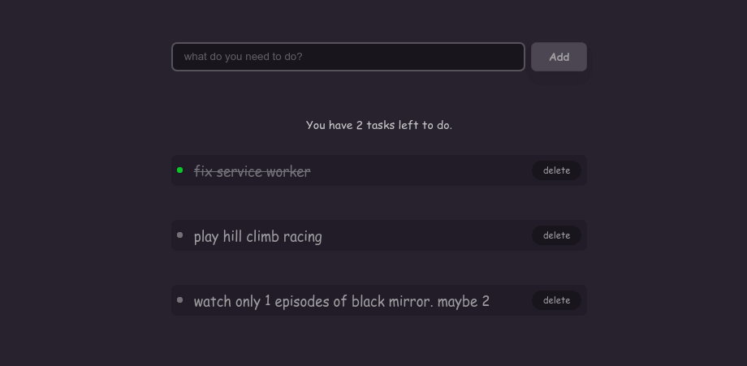

# Vailla-Todo

A Simple Todo PWA built with React

[Live Demo](https://awesome-vanilla-todo.netlify.app)



## Project setup

### Clone repository

```sh
git clone https://github.com/awesomeyinka/vanilla-todo.git
```

### Install dependencies

```sh
yarn install
```

### Serve in dev mode, with hot reload at localhost:8080

```sh
yarn start
```

### Builds for production

```sh
yarn build
```

## License

MIT
